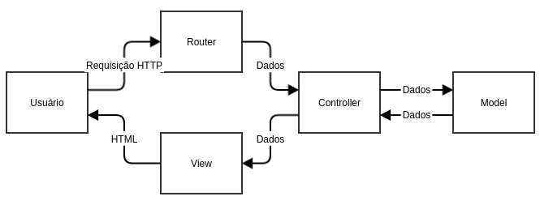

# Project Pedro (kkkkk)

# Arquitetura MODEL VIEW CONTROLLER (MVC)

## Estrutura Clássica de uma Aplicação WEB

Aplicações WEB costumam adotar uma arquitetura de **Cliente-Servidor** no qual o Cliente corresponde à parte da aplicação com o qual o usuário interage diretamente (site, aplicativo de celular, etc...) que normalmente apenas tem o trabalho de receber informações do cliente, repassá-las ao servidor, que as processa, e mostrá-las ao usuário de forma interessante.

O servidor, por sua vez, recebe informações do cliente faz os tratamentos adequados e decide o que deve ser devolvido ao usuário.

Essa comunicação é feita via requests HTTP (GET, POST, PUT, DELETE) e normalmente ocorrem entre o computador com usuário e o servidor. O cliente se comunica com o servidor por meio de diversas rotas (endpoints), aos quais o servidor responde corretamente.

Por exemplo, quando acessamos um site normalmente se acessa a rota raíz do endereço - "/". 

> www.site.com/

Neste caso, a rota sendo acessada é "/". Para cada rota, pode-se definir diferentes funcionalidades dependendo do tipo de request HTTP feito. Os tipos de request HTTP são os seguintes:

1. GET

Utilizado para obter informações do servidor. Utiliza-se de "query-parameters" para passar as informações necessárias ao servidor para obter os dados desejados.

> www.site.com/?parametro_um=valor_1&parametro_dois=valor_2

O "?" indica o inicio dos parametros de query. Cara parametro recebe um valor, após "=". Os parametros são separados por "&".

Ao entrar em um site pelo navegador o procedimento padrão é enviar um request do tipo GET para o servidor para o endereço que consta na barra de url.

2. POST

Utilizado para enviar informações para o servidor. Não pode ser criado diretamente via barra de url do navegador, deve ser feito um request HTTP POST própriamente dito. Isso pode ser feito tanto por código, com bibliotecas (axios para nodejs), ou via programas de terminal (wget, curl, etc...).

Diferente do GET, os dados enviados não sao passados pela url (query parameters) mas é adicionado um campo dentro do request chamdo "body" que contém os dados em algum formato específico (json, xml, text, etc...) que pode ser configurado através dos headers (cabeçalhos de configuração) HTTP.


3. PUT

Semelhante ao POST, porém sua intenção é de ser usado quando deseja-se atualizar um valor de algo que já exista, e não criar um novo, como é o caso do POST.


4. DELETE

Utilizado para remover elementos já criados.

Para dar um outro exemplo, vou usar o app do ikida. Temos guardado em um banco de dados todas as frases do yuri. Vamos dizer que o servidor pra acessar o aplicativo seja "www.ikida.com". Se fossemos criar um servidor para interagir com esse banco de dados, poderiamos criar uma rota chamada "frases". Para acessá-la seria apenas entrar em:

> www.ikida.com/frases

Neste caso estariamos acessando a rota "/frases" utilizando o GET. Poderiamos nesse caso obter todas as frases do mestre yurão guardadas no banco.

Digamos agora que queremos pegar só uma frase e que sabemos que as frases tem id`s para cada uma. Poderiamos utilizar os query parameters para dizer qual o id que queremos pegar especificamente, por exemplo: Vamos dizer que "Cow Marx - Ikida, GURI. 2019" tem id 10, poderiamos obter essa frase da seguinte maneira

> www.ikida.com/frases?id_frase=10

No servidor, podemos esperar a passagem de um query parameter chamado id_frase e, caso ele se encontre presente no request (como é esse caso), retornar apenas a frase correspondente do ID.

Se fizessemos um outro request do tipo POST para o mesmo terminal, e colocassemos, por exemplo, o seguinte body:

```json
{
    "frase": "Lógico que existe cobra herbívora, tem cobra que come inseto... - Guguri, Ikida. 2019"
}
```

Poderiamos programar o servidor para receber esse tipo de dado e adicionar a frase ao banco de dados.

## O modelo MVC




A arquitetura MVC é uma proposta para implementação de aplicações cliente-servidor, no qual a estrutura do projeto segue uma estrutura em camadas, na qual cada camada cuida de um aspecto diferente necessário para o funcionamento da aplicação de forma independete. O modelo apresenta 3 camadas:

+ Model

Responsável pela leitura, escrita e validação dos dados. Nesta camada são implementadas as regras de negócio - o que deve ser feito com os dados e como o servidor deve responder ao cliente.

Normalmente onde são implementadas as formas de comunicação com os bancos de dados, onde são acessadas API`s de outras funcionalidades e onde são feitas as "computações" necessárias para realizar a tarefa desejada.

Normalmente implementado usando linguagens de programação variadas (javascript, Java, C, C++, python, etc...)

+ View

Responsável pela interação com o usuário, apresentação de informações e dados. Normalmente implementado em HTML + CSS + JS para WEB.

Existem diversas frameworks pra facilitar a criação das interfaces. Utilizando Javascript (JS) temos: Angular, React, Vue, entre outros. Existem frameworks em Outras linguagens também.

+ Controller

Responsável por lidar com as requisições HTTP do usuário e encaminhar os pedidos para os models e views adequados. É aqui que as rotas são definidas.

Pode ser feito em diversas linguagens também. Com javascript temos algumas biblitoecas para facilitar toda a criação do servidor http, o express é um exemplo. Para python temos o flask.

----


# Criando uma aplicação MVC simples: Editor de frases do Ikida

Para começar, vamos criar a estrutura básica de uma aplicação MVC:


## Instação e Setup

Crie uma pasta para sua aplicação e inicialize um projeto npm

```
> mkdir projeto_mvc
> cd projeto_mvc
> npm init -y
```

Instale os packages necessário com o npm:

```
> npm install --save express body-parser ejs 
```

Adicione os scripts para startar o projeto e rodar em modo dev no arquivo package.json

```json
  "scripts": {
    "test": "echo \"Error: no test specified\" && exit 1",
    "start": "node app.js", // Adicionar
    "dev": "nodemon app.js" // Adicionar
  },
```

Após criar o projeto, crie a seguinte estrutura de pastas e arquivos:

```
.
+-- package.json
+-- README.md
+-- app.js
+-- src
|   +-- controllers
|   |   +-- frasesController.js
|   +-- routes
|   |   +-- frasesRoutes.js
|   +-- models
|   |   +-- fraseModel.js
|   +-- views
|   |   +-- frasesView.ejs
```

## Implementação dos códigos

Cada um dos arquivos está apresentado a seguir com uma breve explicação e o código comentado na sequencia. Eles servem como uma base para projetos desse tipo e devem ser alterados conforme a necessidade.

Cada um dos subtitulos a seguir apresenta o nome do arquivo com o caminho mostrado baseando-se que você está na pasta raíz do projeto.

## 1. app.js

Arquivo base do servidor.

Inicia-se a aplicação rodando este arquivo - npm start OU npm run dev.

Criam-se as rotas base e as associam as sub-rotas definidas em src/routes.

```js
const express = require("express") // Framework para servidores HTTP
const bodyParser = require("body-parser") // Middleware para Express - tratamento dos requests recebidos
const path = require("path") // Biblioteca do node para tratar caminhos de arquivos de forma correta

// Cria a instancia do aplicativo
const app = express()

// Configurações do express
app.use(bodyParser.urlencoded({ extended: false })) // config basica padrao
app.use(bodyParser.json()) // config basica padrao

app.set('view engine', 'ejs') // config para usar o ejs para renderizar as páginas
app.set("views", path.resolve(__dirname, 'src', 'views')) // config para setar o diretório em que as views estão


// Definição base das rotas (parte do CONTROLLER)
const frasesRoutes = require('./src/routes/frasesRoutes')
app.use('/', frasesRoutes)
app.use('/frases/', frasesRoutes)


// Inicia o servidor
var port = process.env.port || 3000;

app.listen(port, () => console.log(`Servidor ligado em http://localhost:${port}/`))

module.exports = app;  
```

## 2. src/routes/frasesRoutes.js

Arquivo de definição das Rotas para frases.

As rotas são parte da camada do Controlador, mas são separadas para melhor entendimento e separação do código.

Rotas apresentam um 'endereço' e um ou mais tipos request HTTP (GET, POST, PUT, DELETE, etc...).

Uma rota associa um endereço (url) a um controlador.

Note que neste momento estamos analisando as rotas a partir do endereço "/frases/" - definido no arquivo app.js, sendo assim, as rotas descritas aqui, são anexadas ao endereço base "/frases/".

```js
const express = require("express")

const router = express.Router() // Router é utilizado para a criação de rotas no express

const frasesController = require("../controllers/frasesController")
const frase = require('../models/fraseModel')

router.get('/', frasesController.fraseHome) // Rota /frases/ associada ao controlador fraseHome

router.post('/add', frasesController.addFrase) // Rota /frases/add associada ao controlador addFrase

module.exports = router;  
```

## 3. src/routes/frasesController.js

Arquivo de definição dos controladores para frases.

Os controladores são responsáveis por fazer o intermédio entre o Model e as Views baseado nos dados recebidos por ele após ser encaminhado por uma determinada rota.

As regras de negócio definidas no Model são executadas, conforme necessidade, e o controlador é responsável por interpretar os resutados das chamadas das funções do modelo e apresentar as páginas corretas ao usuário.

Neste modelo de arquivo cria-se um objeto {} contendo funções como propriedades. Esse objeto é então exportado e essas funcões podem ser acessadas diretamente a partir do objeto

```js
var fraseModel = require('../models/fraseModel') // Importando o modelo correspondente para frases

// Objeto contedo todos os controladores
var frasesController = {

    // Controlador para exibir a pagina inicial das frases, contendo a interface. Neste caso queremos obter
    // todas as frases para disponibiliza-las em uma lista
    // GET /frases/
    fraseHome(req, res) {
        // Chama a funcão getFrases do modelo, responsável por obter todas as frases e retornar em uma lista
        fraseModel.getFrases((err, data) => {
            try {
                if (err) {
                    console.log(err)
                }
                // caso tenhamos dados de frases passamos esses dados para a pagina frasesView
                else if (data) {
                    res.render('frasesView', { data: data })
                }
                // Caso não tenha nenhuma frase manda um objeto vazio
                else {
                    res.render('frasesView', { data: {} })
                }
            } catch (error) {
                console.log(error)
            }
        })
    },

    // Controlador para adicionar uma frase à lista de frases, deve chamar a função do modelo de frases
    // responsável pela inserção de novas frases
    // POST /frases/add
    addFrase(req, res) {
        try {

            // Podemos obter os dados enviados pelo POST acessando a propriedade body do nosso request (req)
            // e acessando o campo frase (setado no action="POST" do frasesView.ejs) do formulário enviado
            let frase = req.body.frase;

            // Chama a função addFrase passando a frase obtida do POST request acima
            fraseModel.addFrase(frase, (err, data) => {
                if (err) {
                    console.log('error occured', err)
                }
                else {
                    // Caso não ocorra erro redireciona para /frases/
                    // fazendo com que o navegador efetue um GET para /frases/, carregando novamente toda a lista e atualizando a pagina
                    res.redirect('/frases/')
                }
            })
        }
        catch (error) {
            console.log('error', error)
        }
    }

}

module.exports = frasesController;  
```

## 4. src/routes/frasesModel.js

Arquivo de definição model das frases.

O model é responsável por obter dados, tratá-los e implementar as regras de negócio, ou seja, como os dados são processados, o que podem ou não ser feito dentro do sistema, quais dados são retornados e assim por diante.

```js

const frases = ["Lógico que existe cobra herbívora, tem cobra que come inseto... - Guguri, Ikida. 2019", "Yuri, O que significa Iron Maiden? Ué, 'feito de aço', não é?- Ikida, Guri. 2020", "sky-fi - Ikida, Guri. 2019"]

// Retorna todas as frases
function getFrases(cb) {
    cb(null, frases)
}

// Adiciona uma frase a lista de frases
function addFrase(novaFrase, cb) {
    frases.push(novaFrase)
    cb(null, frases)
}

module.exports = { getFrases, addFrase }
```

## 5. src/routes/frasesView.ejs

Página HTML das frases contendo uma lista de todas as frases e um formulário para adicionar frases.

Utiliza o [ejs](https://ejs.co/) como engine para renderizar a página HTML. Basicamente isso quer dizer que trata-se de um arquivo de um tipo especial no qual pode-se utilizar HTML em conjunto com Javascript. É uma espécie de framework bastante simples porém útil.


```ejs
<html lang="en">
  <head>
    <meta charset="UTF-8" />
    <meta name="viewport" content="width=device-width, initial-scale=1.0" />
    <meta http-equiv="X-UA-Compatible" content="ie=edge" />
    <title>Document</title>
  </head>

  <body>
    <h4>Adicionar nova frase</h4>
    <form action="/frases/add" method="POST">
      <table>
        <tr>
          <td>
            <input type="text" name="frase" placeholder="frase" />
          </td>
          <td><input type="submit" value="add" /><br /></td>
        </tr>
      </table>
    </form>
    <br />
    <% if (data.length > 0) {%>
    <h2>AllFrases</h2>
    <table
      border="1"
      style="
        text-align: center;
        font-family: 'Courier New', Courier, monospace;
        font: 600;
      "
    >
      <thead>
        <tr>
          <th>frase</th>
        </tr>
      </thead>
      <tbody>
        <% for(var i=0; i < data.length; i++) {%>
        <tr>
          <td><%= data[i]%></td>
        </tr>
        <% } %>
      </tbody>
    </table>
    <% } %>
  </body>
</html>
```

## Rodando o projeto

Tendo tudo sido instalado de maneira correta e todos os arquivos criados e salvos, pode-se executar o comando

```
> npm start

equivalente a (devido ao script start)

> node app.js
```

para rodar o servidor, ou

```
> npm run dev

equivalente a (devido ao script dev)

> nodemon app.js
```

para iniciar em modo de desenvolvimento.